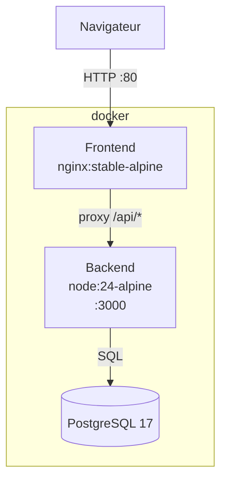

# VitalSync

Suivi médical et sportif: application fullstack conteneurisée avec chaîne CI/CD complète.

## Architecture



## Prérequis

- Docker Engine 29+
- Docker Compose v2 (`docker compose`, pas `docker-compose`)
- Node.js 24 (dev local uniquement)

## Démarrage

```bash
cp .env.example .env
# renseigner les valeurs dans .env
docker compose up -d
curl http://localhost:3000/health
```

## Structure des branches (Gitflow)

```
main       production, protégée (PR obligatoire)
develop    intégration, déclenche la CI à chaque push
feature/*  fonctionnalités isolées
```

## Pipeline CI/CD

Fichier : `.github/workflows/ci-cd.yml`

| étape | déclencheur | contenu |
|-------|-------------|---------|
| lint et tests | push develop + PR main | ESLint v9 + Jest |
| build et push | push develop uniquement | images Docker envoyée vers le GHCR, tag `sha-<commit>` |
| staging | push develop uniquement | `docker compose up`, health check `/health` |

## Variables d'environnement

Voir `.env.example`. Ne jamais committer `.env`.

| variable | rôle |
|----------|------|
| `utilisateur_bdd` | utilisateur PostgreSQL |
| `cle_bdd` | mot de passe PostgreSQL |
| `nom_bdd` | nom de la base |
| `port_api` | port backend (défaut 3000) |
| `port_web` | port frontend (défaut 80) |

## Choix techniques

| outil | justification |
|-------|---------------|
| node:24-alpine | LTS avril 2026, alpine réduit la surface d'attaque |
| express v5 | stable, minimal, standard REST |
| jest v30 + supertest | écosystème standard node.js |
| eslint v9 flat config | nouvelle API sans `.eslintrc`, plus maintenable |
| postgres:17 | stable, 18 trop récent pour la prod |
| nginx:stable-alpine | officielle, légère, proxy_pass natif |
| github actions | natif github, GHCR intégré via GITHUB_TOKEN |
| ingress vs nodeport | routing L7, TLS natif, un seul point d'entrée |
