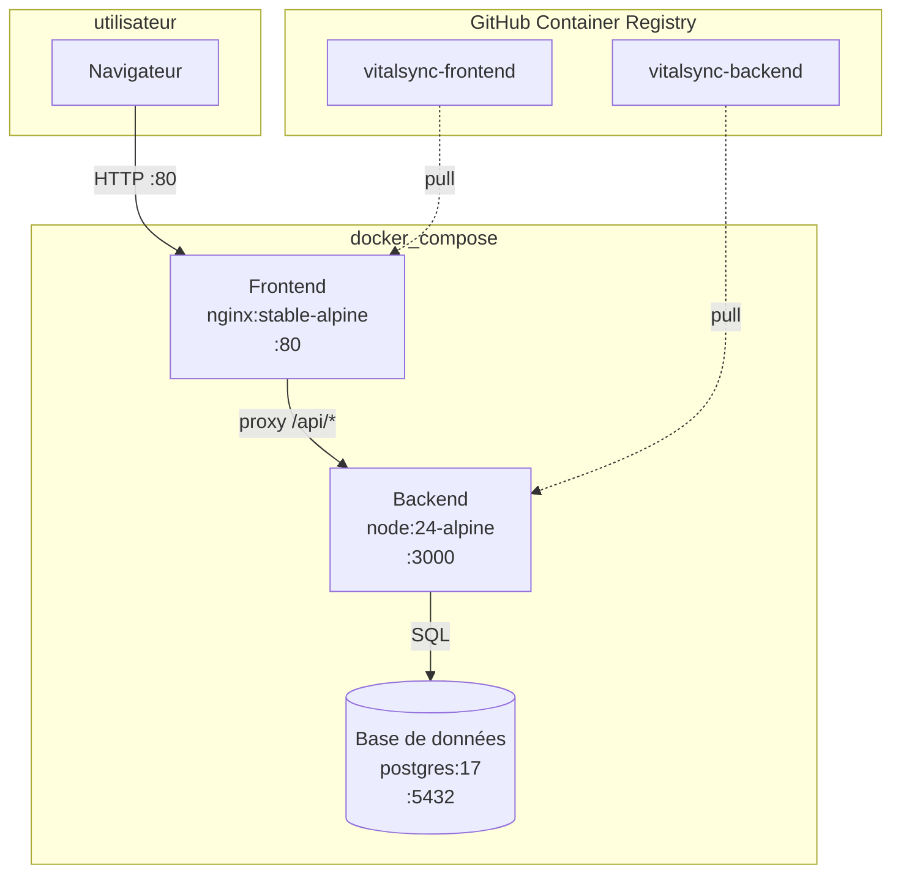

# VitalSync

Surveillance des signes vitaux — application fullstack conteneurisée avec chaîne CI/CD complète.

## Architecture



## Prérequis

| outil | version minimale |
|-------|-----------------|
| Docker Engine | 29.x |
| Docker Compose v2 | 2.x (`docker compose`, pas `docker-compose`) |
| Node.js | 24.x (dev local uniquement) |
| Git | 2.x |

## Démarrage rapide

```bash
# copier et renseigner les variables
cp .env.example .env
# éditer .env avec vos valeurs réelles

# démarrer les 3 services
docker compose up -d

# vérifier l'état du backend
curl http://localhost:3000/health

# ouvrir le frontend
xdg-open http://localhost
```

## Commandes utiles

```bash
# logs en temps réel
docker compose logs -f

# rebuild après modification du code
docker compose up -d --build

# arrêt propre avec suppression du volume de données
docker compose down -v

# tests + lint en local
cd backend && npm ci && npm test && npm run lint
```

## Pipeline CI/CD

Fichier : `.github/workflows/ci-cd.yml`

Déclencheurs :
- **push sur `develop`** → toutes les étapes
- **pull request vers `main`** → étape 1 seulement (lint + tests)

| étape | contenu | outil |
|-------|---------|-------|
| 1 — lint et tests | ESLint v9 + Jest sur le backend | `ubuntu-latest` |
| 2 — build images | `docker build` + push sur GHCR avec tag `sha-<commit>` | `docker/build-push-action@v7` |
| 3 — staging | `docker compose up`, health check `/health`, teardown | `curl --fail --retry` |

Le tag `sha-<commit>` garantit la traçabilité complète : chaque image correspond à un commit précis.
Un tag `latest` ambigu ne permet pas de savoir quel commit est en production.

Les secrets (`cle_bdd`) sont stockés dans GitHub Secrets, jamais en clair dans les fichiers.
Le token GHCR utilise `GITHUB_TOKEN` builtin — aucun PAT supplémentaire nécessaire.

## Stratégie de branches (Gitflow)

```
main          ← production, protégée (PR obligatoire, revue requise)
develop       ← intégration — tous les pushes déclenchent la CI
feature/*     ← fonctionnalités isolées, mergées dans develop
```

## Git : merge vs rebase

| critère | `git merge --no-ff` | `git rebase` |
|---------|---------------------|--------------|
| historique | conserve les branches avec merge commit | linéaire, plus lisible |
| conflits | résolus une seule fois | résolus commit par commit |
| usage conseillé | feature → develop (traçabilité) | mise à jour locale avant PR |
| règle d'or | toujours pour les merges partagés | **jamais** sur une branche déjà poussée |

Dans ce projet : `merge --no-ff` pour intégrer les features dans develop.

## Choix techniques

| technologie | choix | justification |
|-------------|-------|---------------|
| Runtime | Node.js 24 LTS (`node:24-alpine`) | version LTS stable avril 2026, alpine réduit la surface d'attaque |
| Framework | Express v5.2.1 | stable, minimal, standard pour les API REST Node.js |
| Tests | Jest v30 + Supertest v7 | écosystème standard, intégration native avec Express |
| Linter | ESLint v9 (flat config) | nouvelle API sans `.eslintrc`, plus maintenable |
| Base de données | PostgreSQL 17 | version stable éprouvée (18 trop récent pour la prod) |
| Reverse proxy | nginx:stable-alpine | officielle, légère, proxy_pass natif |
| CI/CD | GitHub Actions | natif GitHub, marketplace riche, GHCR intégré |
| Registre images | GHCR (ghcr.io) | auth via `GITHUB_TOKEN` builtin, zéro configuration externe |
| Orchestration | Kubernetes (manifestes) | standard industrie, self-healing natif via ReplicaSet |
| Ingress K8s | Ingress nginx | routing L7, TLS natif, un seul point d'entrée vs NodePort |

## Variables d'environnement

Voir `.env.example` pour la liste complète. **Ne jamais committer `.env`.**

| variable | rôle |
|----------|------|
| `utilisateur_bdd` | nom d'utilisateur PostgreSQL |
| `cle_bdd` | mot de passe PostgreSQL (secret) |
| `nom_bdd` | nom de la base de données |
| `port_bdd` | port PostgreSQL (défaut : 5432) |
| `port_api` | port du backend (défaut : 3000) |
| `port_web` | port du frontend (défaut : 80) |
